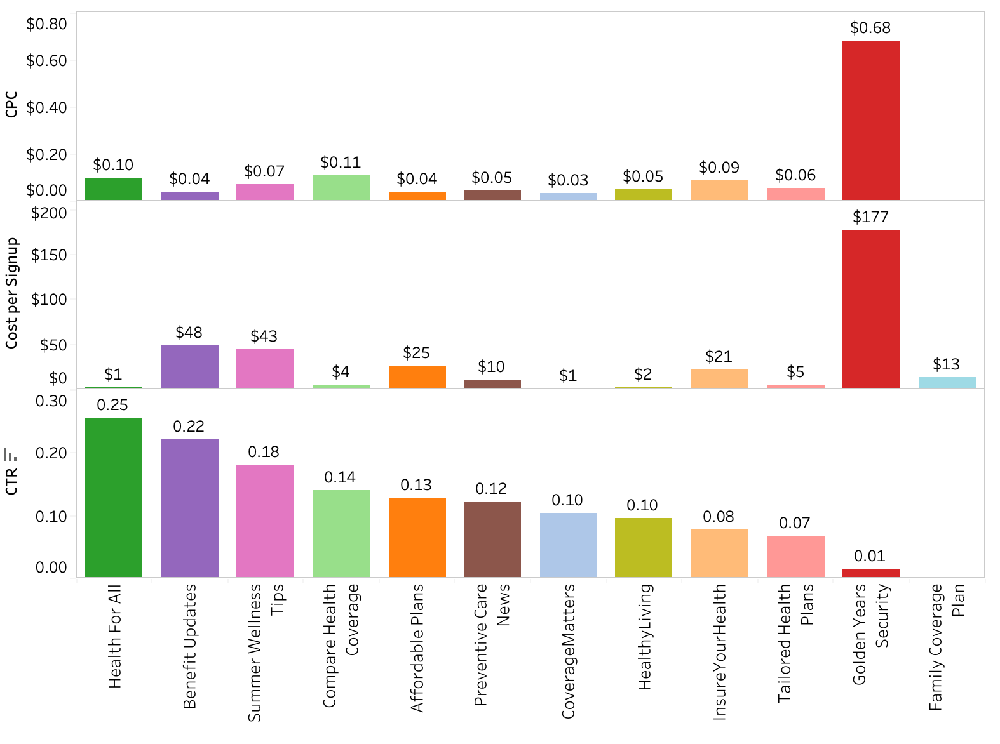
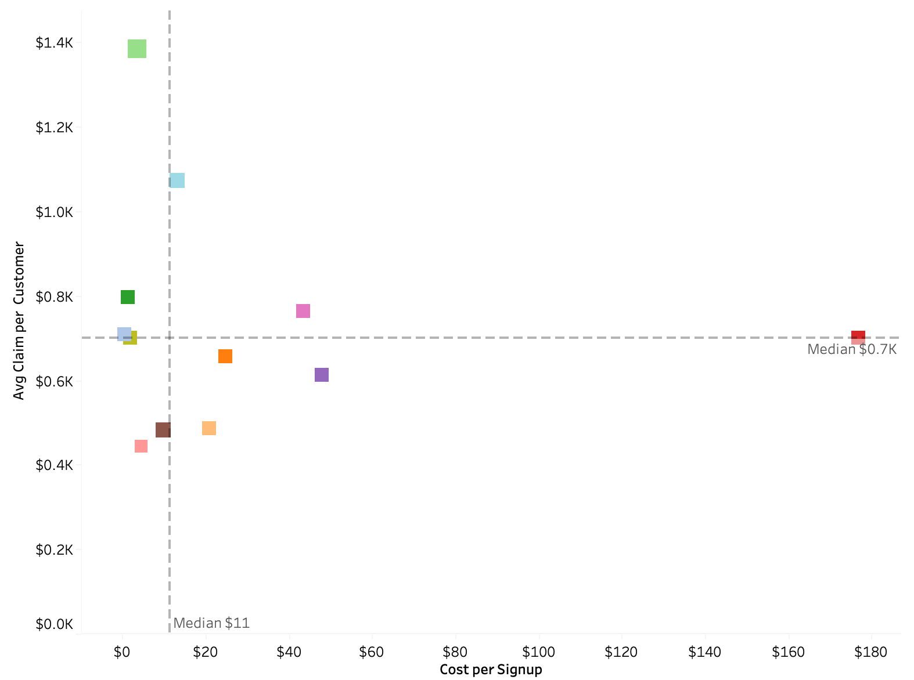
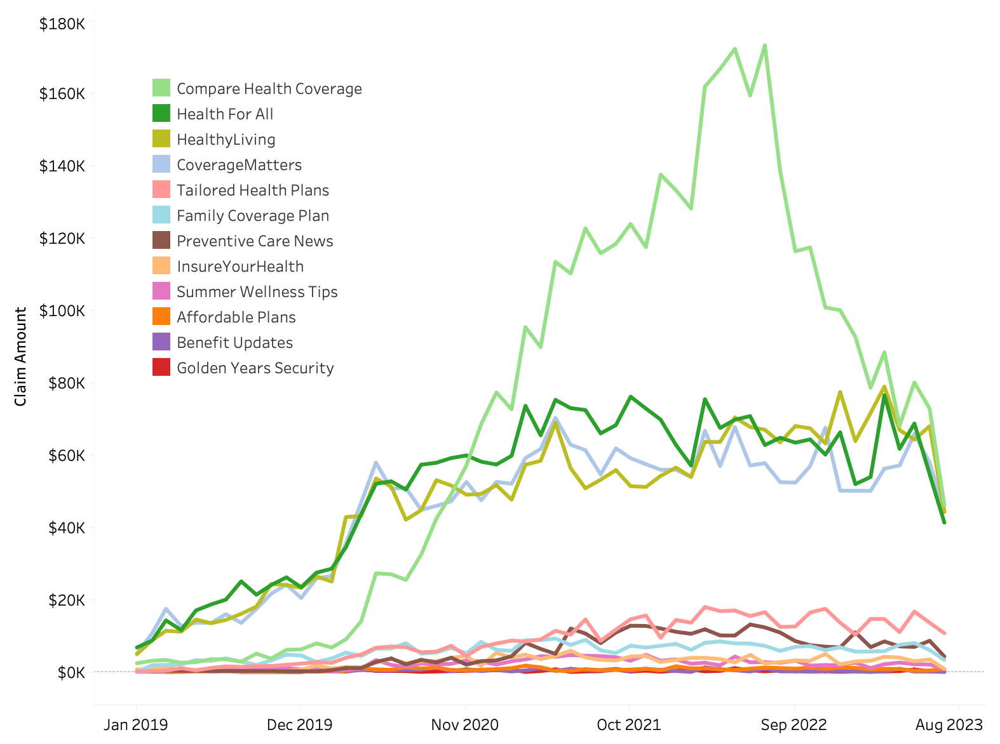
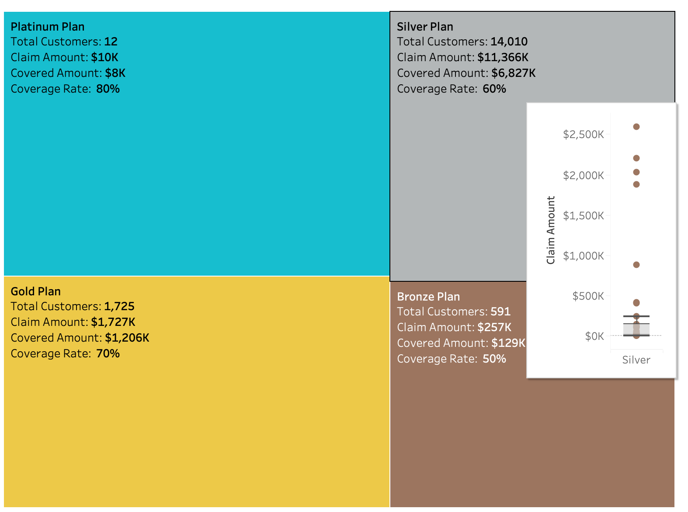
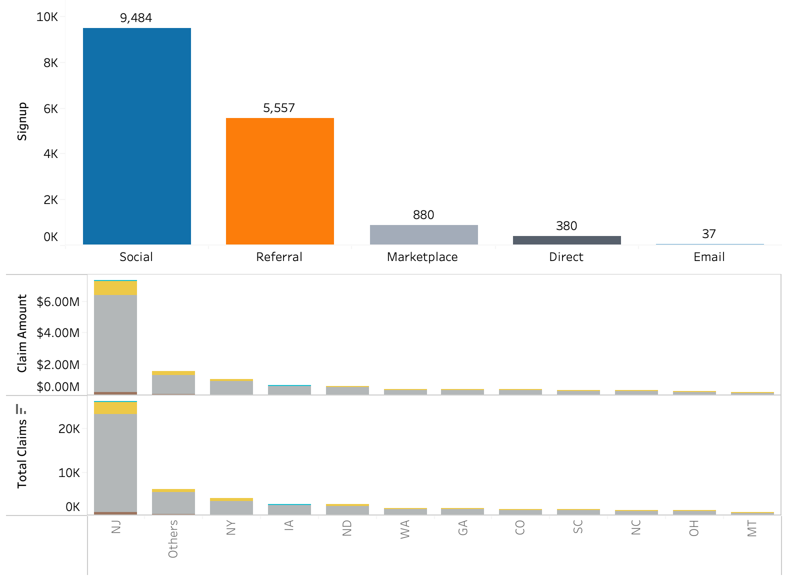
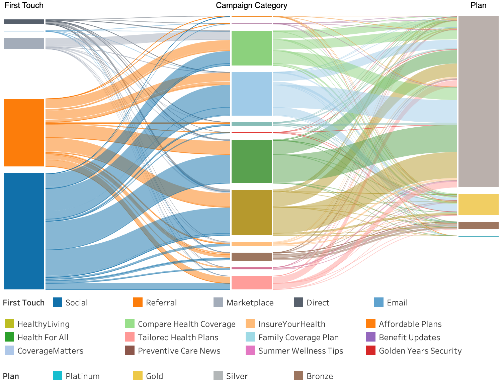

# Health Marketing Analysis

This project analyzes marketing performance for a US based medical insurance company founded in 2015. The company offers four plans **Bronze, Silver, Gold, and Platinum** with different premiums and levels of coverage. In 2019, the company introduced new marketing campaign categories aimed at increasing customer acquisition, improving brand awareness across US, and drive enrollment in higher value plans.

The goal of the analysis is to evaluate the effectiveness of these marketing strategies in terms of customer signups and subsequent insurance claims. The insights generated will support data driven budget allocation decisions for future marketing campaigns.

 <b>Key Stakeholder Questions</b>

The health insurance company wants to understands how the marketing campaigns are performing and increase low risk signups in premium plans.
    
- Which marketing camapings generate the highest number of signups?
- How should the marketing budget be allocated to maximize impact?
- How do different campaigns influence plan selection?

 <b>Data & Tech Info</b> 

- **Data Processing & Analysis**: Python, Pandas, NumPy, Excel, SQL
- **Visualization**: Matplotlib, Seaborn, Plotly
- **Dashboard**: Tableau (explored with Power BI desktop as well)

[**View Tableau Dashboard**](https://public.tableau.com/views/HealthCampaign/Marketing?:language=en-US&:sid=&:redirect=auth&:display_count=n&:origin=viz_share_link)

**Overall Performance** across all campaigns:

| North Star Metrics | Value |
|--|--|
| **Click Through Rate (CTR)** | **9.39%** |
| **Cost per Click (CPC)** | **\$0.07** |
| **Total Signups** | **16,289** |
| **Signup Rate** | **0.18%** |
| **Cost per Signup** | **\$3.68** |
| **Average Claim Amount** | **\$267** |

## 1. Campaign Performance Insights

>
> <table width="100%">
>   <tr>
>     <td align="center" width="50%">
>        
>     </td>
>     <td align="center" width="50%">
>        
>     </td>
>   </tr>
>   <tr>
>     <td colspan="2">
>       <b>Fig. 1a.</b> Marketing Campaign efficiency metrics(click per cost (CPC), Click per Signup, and Click Through Rate (CTR)) by campaign category. <b>1b.</b> Average Claim per Customer vs Cost per Signup by Campaign Category where bubble size shows Avg. claim amount and color shows campaign category.
></td></tr>
> </table>
>

- Overall campaign performance remains efficient with an average **CPC of \$0.07** and **Cost per Signup of \$3.68**. 
- **Health for All** and **Benefit Updates** campaigns have the strongest customer engagement with the highest click through rate (CTR) (~25% and ~22%). High CTR indicates compelling messaging and effective targeting that resonates well with the audience.
- **Healthy Living** campaigns  with 0.10 CTR drive the **largest share of total signups (~23%)** followed closely by **Health for All** and **Coverage Matters** campaigns (each ~22%). This suggests that CTR reflects initital engagement but conversion success also depends heavily on customer targeting and camapign relevance.
- **Golden Years Security** campaigns stand out as extreme outliers with the **highest CPC(\$0.68)** and **Cost per Signup (\$177)**. The scatter plot (Fig. 1b) position this category in the **high cost and high claim** quadrant suggesting inefficient acquisition and high downstream claims risk. 
- **Compare Health Coverage** generated the highest average claim amount despite realtively low acquisition costs. While cost efficient on the front end, this campaign requires further analysis to determine whether savings on acquisitions will be outperformed by higher long term claims exposure.
- **Covid awareness** type of campaigns has low signup contribution with high cost per click \$0.11. 
- **Tailored Health Plans** campaign has the lowest average claim per customer while maintaining a Cost per signup of only **\$5** (Fig. 1b). This combination of cost efficiency and favorable risk profile makes them a strong camapign category for increased investments.
- **Offer Announcements** based campaigns generated minimal engagement, with lowest click through rate (CTR) of ~6% among the campaign types resulting in only 61 signups.
- **Health Awareness** and **Policy information** based Campaigns delivered solid engagement with high CTR of 15% and low CPC of **\$0.04**. 
- There are Critical quality signals with several anomalies. 
	- **Family Coverage Plan** campaigns recorderd **~1.1M impressions with zero clicks** which is highly unlikely in a real world scenario. 
	- **Policy Information** based campaigns under the **Health for All category** incurred \$1,254 spend with zero signups. 
	- **Golden Years Security** showed instances of zero clicks despsite meaningful spend for the Covid awarenesss based camapaigns.

	These zero activity or extreme outliers will affect decision making.

 **Recommendations**
 - **Scale High Performing, Low Risk Campaigns**\
	Prortized increased investment in\
 			- **Health for All** (high engagment and high conversion)
 			- **Healthy Living** (highest signup volume)
 			- **Tailored Health Plans** (cost efficient and low claims risk)
 - **Review or  Discontinue High Cost or High Risk Campaigns** 
	- Reassess **Golden Years Security** camapaigns due to poor efficiency and high risk profile. Conisder pausing or shifting budget away from underperforming campaign themes like COVID awareness, product promotions for this category.
	- **Compare Health Coverage** may be attracting higher risk customer profiles. Further full claims vs acquisition analysis required before any scaling to ensure long term profitability.
- **Reduce or Pause Low Impact Campaigns**
 	- Scale back **Offer Announcements and COVID Awareness** based campaigns which have limited engagement and conversion imapct.
 - **Immediate Data Quality Analysis**\
	Investigate anomalies (zero clicks on high impressions, spend without conversions) to validate tracking integrity. Implement closed loop reporting that connects marketing data with enrollment and claims system for more reliable insights.

## 2. Claim Analytics Insights

**Overall Claims Behavior**:
- **Total Claims Filed**:~50K
- **Average Claims per Customer**:3.1
- **Average Claim Amount**: \$267

>
> <table width="100%">
>   <tr>
>     <td align="center" width="50%">
>        
>     </td>
>     <td align="center" width="50%">
>        
>     </td>
>   </tr>
>   <tr>
>     <td colspan="2">
>       <b>Fig. 2a.</b> Monthly claims trend by campaign category. <b>2b.</b> Plan Performance Overview: number of customers filing claims, Claims amount & coverage rate. (Inset: Claim amount distribution boxplot for Silver Plan).
></td></tr>
> </table>
>

- Average coverage rate across plans are Platinum (80\%), Gold (70\%), Silver (60\%), and Bronze (50\%).
- Customers are filing an **average of 3.1 claims** each signaling strong utilization and engagement with the insurance plans. However, this highlights the importance of acquiring low risk customers to sustain long term profitability.
-  **Compare Health Coverage** campaigns generates the highest and fastest growing claim volumes.  Fig. 2a shows that monthly claims from this category peaked at \$173K in July 2022 and show an average claim rate approximately 50\% higher than the average claim rate. In contrast, **Health for All, Healthy Living, and Coverage Matters** campaigns experienced claim increases from 2019 but have since stabilized around \$50K per month. This more predictable and stable claims behvior makes them far more reliable for scaling.
- **Compare Health Coverage** campaigns appear to be attracting higher cost customer profile. 
- The Silver plan is the primary revenue driver with highest customer volume but also the highest risk segment with the largest  claim amount. The claim amount distribution revelas presence of outliers with extremely high claim values suggesting that higher risk customers are choosing mid tier plans.

**Recommendations**
- **Reduce over reliance on Silver Plan Acquisitons**\
	 Shift focus toward targeted upsell campaigns to migrate existing Silver customers to Gold and Platinum plans, improving the overall risk mix and increasing average coverage rates.
- R**efine High Risk campaign targeting**\
	Reassess **Compare Health Coverage** campaigns by tightening audience segmentation to exclude high risk profiles. 
- **Investigate claim outliers**\
	Conduct a detailed analysis of extreme high claim cases in the silver plan to identify patterns and root causes. This will help to setup exclusion criteria in future marketing.
- **Boost Platinum Plan adoption**\
	 Platinum currently has critically low uptake and engagement with only 12 customers filing for claims. Revisit pricing, positioning, and benefit bundles. Offer incentives to increase uptake.
- **Use Predictive Analytics for Dynamic Targeting**\
	Use historical claims data to build models that predict high risk customers at the point of signup. Integrate these insights into campaign targeting to dynamically favor lower risk segments and optimize the acquisition efficiency.

## 3. Customer Insights

**Overall Customers Behavior**:
- **Total Signup**:16,338
- **Cost per Signup**: \$3.68
- **Signup Rate**: 0.18%

>
> <table width="100%">
>   <tr>
>     <td align="center" width="50%">
>        
>     </td>
>     <td align="center" width="50%">
>        
>     </td>
>   </tr>
>   <tr>
>     <td colspan="2">
>       <b>Fig. 3a.</b> [Top Row] Signup by Marketing channel. [Bottom Row] Total Claims & Claim Amount by State & Plan (Other states represent all state with $\le$ $200K claim amount). <b>3b.</b> Customer Journey flow from First Touch (Marketing Channel) to Campaign Category to Plan.
></td></tr>
> </table>
>

- Over **80% of customer acquisition** is driven by just two channels (Social (58%) and Referral (34%)). While these channels drive the majority of singups, heavy dependence on them will impact signups because of any performance fluctuations.

- **New Jersey** State dominates claims activity and contributes to **53 % of the total claims** outperforming all other states. New york follows as the second highest with ~8% of the total claims. Within New Jersey, **Silver Plan** has the largest customer base followed by Gold, Bronze, and Platinum. Iowa is aother state with Platinum plan memberships.

- The **Sankey diagram (fig. 3b)** shows the customer journey flow from initial marketing channel through campaign category to final plan selection. It highlights that **Platinum plan** adoption remains critically low. Social and Referral channels through four campaign categories (**Healthy Living, Health for All, Coverage Matters and Compare Health Coverage**) leads to Platinum plan adoptions.

**Recommendations**
- **Diversity Acqusition Channels**\
Reduce heavy reliance on social and referral channels by expnading investments in search marketing and exploring additional channels. 
- **Adopt Regional Strategies**\
Analyze state level differences in claims behavior and adjust pricing or coverage options or targeted messaging regionally where needed
- **Drive Higher-Tier Plan Adoption**\
Double down on the limited channels and campaign categories that successfully contributes to Platinum enrollments. 
- **Shift from volume driven to value driven funnel**\
Prioritize targeting and creative strategies that attract lower risk profiles and encourage selection of higher coverage plans like Gold and Platinum to improve overall profitability.
